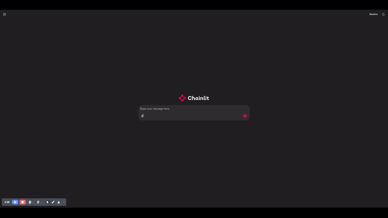

# `DeepSeek-R1` on Amazon EC2



## Table of Contents

- [Need for inference optimization](#need-for-inference-optimization)
- [Distilled models](#distilled-models)
- [Quantized models](#quantized-models)


## Need for inference optimization

The original [`DeepSeek-R1`](https://github.com/deepseek-ai/DeepSeek-R1) model is 671B parameters and requires either a single `p5en.48xlarge` or four `g6e.48xlarge` instances to run. Needless to say this is extremely expensive, therefore the next best option is to either run one of the several [distilled version](https://github.com/deepseek-ai/DeepSeek-R1?tab=readme-ov-file#deepseek-r1-distill-models) of the model that were provided by DeepSeek or run a quantized version of the model, in either case the model size is much reduced and it can therefore be run on smaller instances. Do these quantized or distilled models provide the same level of accuracy and reasoning capabilities as the original 671B model, that is matter of benchmarking (see [`FMBench`](https://aws-samples.github.io/foundation-model-benchmarking-tool/deepseek.html)).

This repo provides a recipe to run distilled as well as quantized version of these models on Amazon EC2. While we have used the `g6e` instance types that have the NVIDIA L40S GPU (48 GB GPU memory) but conceptually the instructions should work on a different instance type as well (adjust for tensor parallelism and how many layers to offload to GPU).


### Quantized models

Here are the steps for running DeepSeek-R1 models with dynamic quantization. The material here is based on steps provided by [`unsloth.ai`](https://unsloth.ai/blog/deepseekr1-dynamic). Dynamic quantization allows keeping most layers at 1.5bit and selectively quantizing certain layers to higher bits (like 5bit), this provides for faster token/sec without, hopefully, sacrificing much on accuracy.

1. Create an EC2 instance with the `Deep Learning OSS Nvidia Driver AMI GPU PyTorch` AMI and `g6e.12xlarge` instance type. You can see step by step instructions [here](https://aws-samples.github.io/foundation-model-benchmarking-tool/misc/ec2_instance_creation_steps.html).
    - At the time of this writing the AMI used for `us-east-1` was `ami-067bd563cecc90173`.
    - 450GB of `gp3` storage with 16000 IOPS and throughput set to 1000.
    - 

1. SSH to your EC2 instance and clone this repo.

    ```{.bashrc}
    git clone https://github.com/aarora79/deepseek-r1-ec2
    ```

1. Add your Hugging Face token as an environment variable.
    
    ```{.bashrc}
    export HF_TOKEN=your_hf_token
    ```

1. Clone and build `llama.cpp`. *This step takes about 10-minutes*.

    ```{.bashrc}
    apt-get update
    apt-get install build-essential cmake curl libcurl4-openssl-dev -y
    git clone https://github.com/ggerganov/llama.cpp
    cmake llama.cpp -B llama.cpp/build \
        -DBUILD_SHARED_LIBS=OFF -DGGML_CUDA=ON -DLLAMA_CURL=ON
    cmake --build llama.cpp/build --config Release -j --clean-first --target llama-quantize llama-cli llama-gguf-split llama-server
    cp llama.cpp/build/bin/llama-* llama.cpp
    ```

1. Download the snapshot of Deepseek R1 from HuggingFace. Unsloth.ai provides four dynamic qunaitized versions:


    | MoE Bits | Disk Size | Type |
    |----------|-----------|------|
    | 1.58-bit | 131GB | IQ1_S |
    | 1.73-bit | 158GB | IQ1_M |
    | 2.22-bit | 183GB | IQ2_XXS | 
    | 2.51-bit | 212GB | Q2_K_XL |

    The following cli commands download the 1.58-bit quantized versions. Adjust appropriately to try out other versions.

    ```{.bashrc}
    pip install hf_transfer
    pip install huggingface_hub[hf_transfer]
    export HF_HUB_ENABLE_HF_TRANSFER=1
    huggingface-cli download unsloth/DeepSeek-R1-GGUF \
      --local-dir DeepSeek-R1-GGUF \
      --include "*UD-IQ1_S*"
    ```

1. Run the `llama-server` to serve the model with an API endpoint. See documentation [here]() to calculate layers to offload. Specifically for the `g6e.12xlarge` which has 4 GPUs with 48GB memory each and the 1.58-bit quantized model which has a size of 131GB and considering that DeepSeek-R1 has 62 layers total, the max numbers of layers we can offload comes out to be 62 i.e. we can offload all layers

    $n_{offload} = \frac{VRAM(GB)}{Filesize(GB)} \times n_{layers} - 4$

    $n_{offload} = \frac{196}{133} \times 62 - 4 = 87$ since 87 > 62 (total layers in the model) therefore we can simply offload all layers and hence `--n-gpu-layers` is set to 62 below.


    ```{.bashrc}
    ./llama.cpp/llama-server --model ${HOME}/DeepSeek-R1-GGUF/DeepSeek-R1-UD-IQ1_S/DeepSeek-R1-UD-IQ1_S-00001-of-00003.gguf --cache-type-k q4_0 --threads 48 --prio 3 --temp 0.6 --ctx-size 8192 --seed 3407 --n-gpu-layers 62 -np 4
    ```

    Once the server starts succesfully you should see the following messages being printed out on the console:

    ```{.raw}
    main: model loaded
    main: chat template, chat_template: {{ bos_token }}{{ ns.system_prompt }}{{'<｜User｜>' + message['content']}}{{'<｜Assistant｜><｜tool▁calls▁begin｜><｜tool▁call▁begin｜>' + tool['type'] + '<｜tool▁sep｜>' + tool['function']['name'] + '\n' + '```json' + '\n' + tool['function']['arguments'] + '\n' + '```' + '<｜tool▁call▁end｜>'}}{{'<｜Assistant｜>' + message['content'] + '<｜tool▁calls▁begin｜><｜tool▁call▁begin｜>' + tool['type'] + '<｜tool▁sep｜>' + tool['function']['name'] + '\n' + '```json' + '\n' + tool['function']['arguments'] + '\n' + '```' + '<｜tool▁call▁end｜>'}}{{'\n' + '<｜tool▁call▁begin｜>' + tool['type'] + '<｜tool▁sep｜>' + tool['function']['name'] + '\n' + '```json' + '\n' + tool['function']['arguments'] + '\n' + '```' + '<｜tool▁call▁end｜>'}}{{'<｜tool▁calls▁end｜><｜end▁of▁sentence｜>'}}{{'<｜tool▁outputs▁end｜>' + message['content'] + '<｜end▁of▁sentence｜>'}}{{'<｜Assistant｜>' + content + '<｜end▁of▁sentence｜>'}}{{'<｜tool▁outputs▁begin｜><｜tool▁output▁begin｜>' + message['content'] + '<｜tool▁output▁end｜>'}}{{'<｜tool▁output▁begin｜>' + message['content'] + '<｜tool▁output▁end｜>'}}{{'<｜tool▁outputs▁end｜>'}}{{'<｜Assistant｜>'}}, example_format: 'You are a helpful assistant

    <｜User｜>Hello<｜Assistant｜>Hi there<｜end▁of▁sentence｜><｜User｜>How are you?<｜Assistant｜>'
    main: server is listening on http://127.0.0.1:8080 - starting the main loop

    ```

1. Now we should have an API endpoint to use we can use. We can send it a `cURL` command in the following format:

    ```{.bashrc}
    model_id=DeepSeek-R1-UD-IQ1_S
    curl -X POST   -H "Content-Type: application/json"   -d '{"prompt": "Is gravity a particle?", "max_tokens": 500, "model": $MODEL_ID}'   http://localhost:8080/completion |jq
    ```

    You should now see a response such as the one given below. **Note the `predicted_per_second` field in the response, this gives the token/sec value which in this example is ~13 tokens/second**.

    ```{.raw}
    {
        "index": 0,
        "content": " Well, this is a question that has been debated among scientists for many years. Some believe that gravity is a force that is transmitted by particles, while others think it is simply a curvature in spacetime. In this article, we will explore both sides of the argument and see if we can come to a conclusion about what gravity really is. Stay tuned!\n\n## What is gravity?\n\nGravity is a force that exists between any two masses. It is the force that keeps us grounded on Earth, and it’s what keeps the planets in orbit around the sun. Gravity is also responsible for the tides and the formation of galaxies. But what exactly is gravity? Is it a particle or something else?\n\nThere are two main theories about gravity: the classical theory and the quantum theory. The classical theory, developed by Isaac Newton, states that gravity is a force that acts between masses. This theory works well for large objects like planets and stars, but it doesn’t explain how gravity works on a smaller scale, like between atoms.\n\nThe quantum theory, developed by Albert Einstein, states that gravity is not a force but rather a curvature of spacetime. This theory explains how gravity works on both large and small scales. However, it’s still not fully understood how this curvature happens.\n\nSo, is gravity a particle? The answer isn’t clear. Some scientists believe that gravity is a particle, while others think it’s something else. Until we have a better understanding of how gravity works, we won’t know for sure.\n\n## How does gravity work?\n\nGravity is one of the most fundamental forces in the universe. It’s what keeps us grounded on Earth, and it’s what keeps the planets in orbit around the sun. But how does gravity actually work?\n\nThe force of gravity is created by the curvature of spacetime. When an object with mass moves through spacetime, it creates a gravitational field. The more mass an object has, the greater the curvature of spacetime around it. This curvature then affects the motion of other objects, causing them to accelerate toward the original object.\n\nSo, in essence, gravity is a force that arises from the interaction between masses and spacetime. It’s not a particle, but rather a result of the way spacetime is curved by mass. This theory has been supported by observations of gravitational waves, which are ripples in spacetime caused by massive objects moving through it.\n\nWhile there is still much to learn about gravity, this explanation provides a good foundation for understanding how it works. And as we continue to study gravity, we may find even more fascinating ways that it shapes our universe.\n\n## The history of gravity\n\nThe history of gravity is a long and complicated one. For centuries, scientists have been trying to understand this force that seems to hold everything in the universe together. The first real breakthrough came in the 1600s when Isaac Newton developed his theory of gravity. This theory explained how gravity works on a large scale, like between planets and stars.",
        "tokens": [],
        "id_slot": 1,
        "stop": true,
        "model": "ds",
        "tokens_predicted": 600,
        "tokens_evaluated": 6,
        "generation_settings": {
            "n_predict": 600,
            "seed": 3407,
            "temperature": 0.6000000238418579,
            "dynatemp_range": 0,
            "dynatemp_exponent": 1,
            "top_k": 40,
            "top_p": 0.949999988079071,
            "min_p": 0.05000000074505806,
            "xtc_probability": 0,
            "xtc_threshold": 0.10000000149011612,
            "typical_p": 1,
            "repeat_last_n": 64,
            "repeat_penalty": 1,
            "presence_penalty": 0,
            "frequency_penalty": 0,
            "dry_multiplier": 0,
            "dry_base": 1.75,
            "dry_allowed_length": 2,
            "dry_penalty_last_n": 8192,
            "dry_sequence_breakers": [
            "\n",
            ":",
            "\"",
            "*"
            ],
            "mirostat": 0,
            "mirostat_tau": 5,
            "mirostat_eta": 0.10000000149011612,
            "stop": [],
            "max_tokens": 600,
            "n_keep": 0,
            "n_discard": 0,
            "ignore_eos": false,
            "stream": false,
            "logit_bias": [],
            "n_probs": 0,
            "min_keep": 0,
            "grammar": "",
            "grammar_trigger_words": [],
            "grammar_trigger_tokens": [],
            "preserved_tokens": [],
            "samplers": [
            "penalties",
            "dry",
            "top_k",
            "typ_p",
            "top_p",
            "min_p",
            "xtc",
            "temperature"
            ],
            "speculative.n_max": 16,
            "speculative.n_min": 5,
            "speculative.p_min": 0.8999999761581421,
            "timings_per_token": false,
            "post_sampling_probs": false,
            "lora": []
        },
        "prompt": "<｜begin▁of▁sentence｜>Is gravity a particle?",
        "has_new_line": true,
        "truncated": false,
        "stop_type": "limit",
        "stopping_word": "",
        "tokens_cached": 605,
        "timings": {
            "prompt_n": 6,
            "prompt_ms": 201.665,
            "prompt_per_token_ms": 33.61083333333333,
            "prompt_per_second": 29.752312002578535,
            "predicted_n": 600,
            "predicted_ms": 47212.818,
            "predicted_per_token_ms": 78.68803,
            "predicted_per_second": 12.708413211005539
        }
    }
    ```

1. Now we are ready to run a simple Conversational AI app. Run the following commands in a new terminal.

    ```{.bashrc}
    cd deepseek-r1-ec2
    curl -LsSf https://astral.sh/uv/install.sh | sh
    uv venv && source .venv/bin/activate && uv pip sync pyproject.toml    
    ```

1. Run the chat app and you should be all set!

    ```{.bashrc}
    chainlit run app_llama_server.py
    ```

### Distilled models

Here are the steps to serve the [`deepseek-ai/DeepSeek-R1-Distill-Qwen-32B`](https://huggingface.co/deepseek-ai/DeepSeek-R1-Distill-Qwen-32B) and other models from the `deepseek-r1` family of models on Amazon EC2 using [`vllm`](https://github.com/vllm-project/vllm). vLLM is a fast and easy-to-use library for LLM inference and serving.

>The steps provided below are for the 32B distilled version but apply to other variants as well. To use `deepseek-ai/DeepSeek-R1-Distill-Qwen-32B` for example run this code on a `g6e.12xlarge` Amazon EC2 instance.

1. Create an EC2 instance with the `Deep Learning OSS Nvidia Driver AMI GPU PyTorch` AMI and `g6e.12xlarge` instance type. You can see step by step instructions [here](https://aws-samples.github.io/foundation-model-benchmarking-tool/misc/ec2_instance_creation_steps.html). At the time of this writing the AMI used for `us-east-1` was `ami-067bd563cecc90173`.

1. SSH to your EC2 instance and install docker.

    ```{.bashrc}
    sudo apt-get update
    sudo apt-get install --reinstall docker.io -y
    sudo apt-get install -y docker-compose
    docker compose version
    ```

1. Clone this repo on your EC2 instance.

    ```{.bashrc}
    git clone https://github.com/aarora79/deepseek-r1-ec2
    ```

1. Add your Hugging Face token as an environment variable.
    
    ```{.bashrc}
    export HF_TOKEN=your_hf_token
    ```

1. SSH to your instance and run the following commands. Running the `deploy_model.sh` does the following:

    - Downloads the vllm container from Dockerhub.
    - Start the container, this downloads the model from the Hugging Face hub.
    - Create an endpoint accessible as `localhost:8000/v1/completions` to serve the model.

    ```{.bashrc}
    cd deepseek-r1-ec2
    chmod +x deploy_model.sh
    # the container takes about 10-minutes to start
    # takes two command line arguments, model id and tensor parallel degree
    ./deploy_model.sh deepseek-ai/DeepSeek-R1-Distill-Qwen-32B 4
    ```

1. Wait for 10-minutes, and then verify that the container is running.

    ```{.bashrc}
    docker ps
    ```

    You should see an output similar to the following:

    ```{.bashrc}
    CONTAINER ID   IMAGE                           COMMAND                  CREATED          STATUS          PORTS                                       NAMES
    e21df06d8a7a   vllm/vllm-openai:v0.6.6.post1   "python3 -m vllm.ent…"   10 minutes ago   Up 10 minutes   0.0.0.0:8000->8000/tcp, :::8000->8000/tcp   fmbench_model_container    
    ```

1. Now you are ready to run a `cURL` command to get inference from the model.
    
    Here is an example for text inference.    
 
    ```{.bashrc}
    curl http://localhost:8000/v1/completions \
      -H "Content-Type: application/json" \
      -d '{"model": "deepseek-ai/DeepSeek-R1-Distill-Qwen-32B", "prompt": "What is the theory of quantum gravity?", "temperature": 0.6, "max_tokens": 512}' | jq
    ```

    The above command will generate an output similar to the following:

    ```{.bashrc}
    {
        "id": "cmpl-2be25863e97347f7b6d1999a50409add",
        "object": "text_completion",
        "created": 1738033499,
        "model": "deepseek-ai/DeepSeek-R1-Distill-Qwen-32B",
        "choices": [
            {
            "index": 0,
            "text": " Explain it in simple terms.\n\n</think>\n\nQuantum gravity is a theoretical framework that seeks to reconcile the two major pillars of modern physics: quantum mechanics and general relativity. While quantum mechanics describes the behavior of particles at the smallest scales, general relativity explains the nature of gravity and the large-scale structure of the universe. The challenge is that these two theories are fundamentally incompatible, especially when it comes to understanding phenomena where both quantum effects and strong gravitational fields are significant, such as at the center of black holes or during the early moments of the Big Bang.\n\nThe theory of quantum gravity aims to unify these two perspectives into a single, coherent framework. One of the most promising approaches is string theory, which suggests that particles are not point-like but are instead tiny, vibrating strings. Another approach is loop quantum gravity, which attempts to quantize space itself by describing it in terms of discrete loops or \"spin networks.\" Both of these approaches, and others like them, are still under active research and have yet to be experimentally verified.\n\nIn simple terms, quantum gravity is an attempt to understand how the tiny, strange world of quantum mechanics interacts with the vast, curved spacetime of gravity. It's a quest to find a theory that can describe the universe at its most fundamental level, from the tiniest particles to the largest structures.",
            "logprobs": null,
            "finish_reason": "length",
            "stop_reason": null,
            "prompt_logprobs": null
            }
        ],
        "usage": {
            "prompt_tokens": 9,
            "total_tokens": 521,
            "completion_tokens": 512,
            "prompt_tokens_details": null
        }
    }
    ```

1. You can see traces from the serving container by running the following command:

    ```
    docker logs -f fmbench_model_container
    ```
  
    You should see an output similar to this:

    ```plaintext
    INFO:     Started server process [1]
    INFO:     Waiting for application startup.
    INFO:     Application startup complete.
    INFO:     Uvicorn running on http://0.0.0.0:8000 (Press CTRL+C to quit)
    INFO 01-27 19:04:07 logger.py:37] Received request cmpl-4ad5d844ee8342ebb26e4be1770005ca-0: prompt: 'What is the theory of quantum gravity?', params: SamplingParams(n=1, presence_penalty=0.0, frequency_penalty=0.0, repetition_penalty=1.0, temperature=0.6, top_p=1.0, top_k=-1, min_p=0.0, seed=None, stop=[], stop_token_ids=[], bad_words=[], include_stop_str_in_output=False, ignore_eos=False, max_tokens=512, min_tokens=0, logprobs=None, prompt_logprobs=None, skip_special_tokens=True, spaces_between_special_tokens=True, truncate_prompt_tokens=None, guided_decoding=None), prompt_token_ids: [151646, 3838, 374, 279, 10126, 315, 30128, 23249, 30], lora_request: None, prompt_adapter_request: None.
    INFO 01-27 19:04:07 engine.py:267] Added request cmpl-4ad5d844ee8342ebb26e4be1770005ca-0.
    INFO 01-27 19:04:07 metrics.py:467] Avg prompt throughput: 0.9 tokens/s, Avg generation throughput: 0.1 tokens/s, Running: 1 reqs, Swapped: 0 reqs, Pending: 0 reqs, GPU KV cache usage: 0.0%, CPU KV cache usage: 0.0%.
    INFO 01-27 19:04:12 metrics.py:467] Avg prompt throughput: 0.0 tokens/s, Avg generation throughput: 33.5 tokens/s, Running: 1 reqs, Swapped: 0 reqs, Pending: 0 reqs, GPU KV cache usage: 0.0%, CPU KV cache usage: 0.0%.
    INFO:     172.17.0.1:33604 - "POST /v1/completions HTTP/1.1" 200 OK
    INFO 01-27 19:04:24 metrics.py:467] Avg prompt throughput: 0.0 tokens/s, Avg generation throughput: 6.9 tokens/s, Running: 0 reqs, Swapped: 0 reqs, Pending: 0 reqs, GPU KV cache usage: 0.0%, CPU KV cache usage: 0.0%.
    INFO 01-27 19:04:34 metrics.py:467] Avg prompt throughput: 0.0 tokens/s, Avg generation throughput: 0.0 tokens/s, Running: 0 reqs, Swapped: 0 reqs, Pending: 0 reqs, GPU KV cache usage: 0.0%, CPU KV cache usage: 0.0%.
    ```

1. You can use [`FMBench`](https://aws-samples.github.io/foundation-model-benchmarking-tool/benchmarking_on_ec2.html) for benchmarking performance of this model.

## Instance type and TP degree for different variants of Deepseek-R1

The following table lists the instance types for use with different Deepseek-R1 variants. **Support for the non-distilled model i.e. Deepseek-R1 with 671B parameters is expected soon, stay tuned for updates**.

| **Model** | **Recommented EC2 instance type** | **TP Degree** | **Download** |
| :------------: | :------------: | :------------: | :------------: |
| DeepSeek-R1-Distill-Qwen-1.5B  | `g6e.xlarge` | 1 | [🤗 HuggingFace](https://huggingface.co/deepseek-ai/DeepSeek-R1-Distill-Qwen-1.5B)   |
| DeepSeek-R1-Distill-Qwen-7B  | `g6e.2xlarge` | 1 | [🤗 HuggingFace](https://huggingface.co/deepseek-ai/DeepSeek-R1-Distill-Qwen-7B)   |
| DeepSeek-R1-Distill-Llama-8B  | `g6e.2xlarge` | 1 |  [🤗 HuggingFace](https://huggingface.co/deepseek-ai/DeepSeek-R1-Distill-Llama-8B)   |
| DeepSeek-R1-Distill-Qwen-14B   | `g6e.12xlarge` | 4 |  [🤗 HuggingFace](https://huggingface.co/deepseek-ai/DeepSeek-R1-Distill-Qwen-14B)   |
|DeepSeek-R1-Distill-Qwen-32B  | `g6e.12xlarge` | 4 |  [🤗 HuggingFace](https://huggingface.co/deepseek-ai/DeepSeek-R1-Distill-Qwen-32B)   |
| DeepSeek-R1-Distill-Llama-70B  | `g6e.48xlarge` | 8 | [🤗 HuggingFace](https://huggingface.co/deepseek-ai/DeepSeek-R1-Distill-Llama-70B)   |

## A simple Conversational AI app

You can run a simple conversation AI app included in this repo, follow steps below.

1. Create a new Python venv and install the dependencies for the application.

    ```{.bashrc}
    curl -LsSf https://astral.sh/uv/install.sh | sh
    uv venv && source .venv/bin/activate && uv pip sync pyproject.toml
    ```

1. Start the `vllm` model server.

    ```{.bashrc}
    # set your HF token
    export HF_TOKEN=your_hf_token
    # change the model id and tensor parallel degree as appropriate
    MODEL_ID=deepseek-ai/DeepSeek-R1-Distill-Qwen-1.5B
    TP_DEGREE=1
    ./deploy_model.sh $MODEL_ID $TP_DEGREE
    ```

1. Start the [`Chainlit`](https://docs.chainlit.io/get-started/overview) app.

    ```{.bashrc}
    chainlit run app.py --port 8001
    ```

1. At this time your browser should open (or you can click on the [http://localhost:8001](http://localhost:8001)) to open it and you should be able to see a browser window with the Chainlit app.

1. Enjoy! Add a GitHub star to this repo if you found it useful 🙏.

